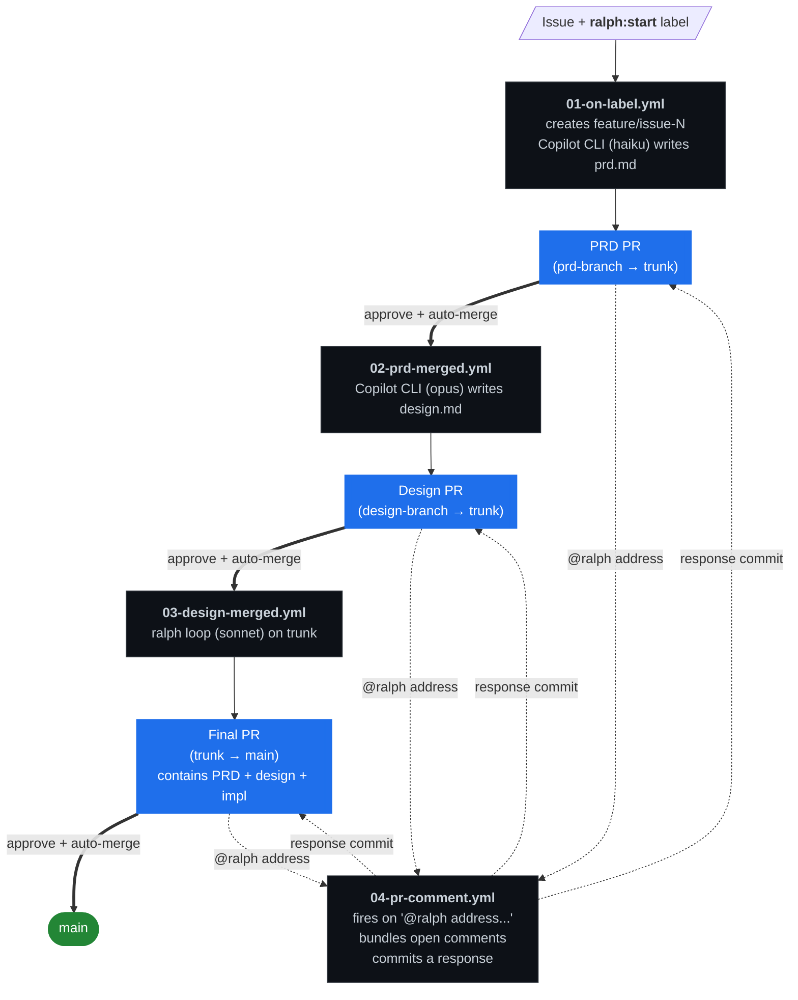

# the-copilot-is-gonna-ralph

GitHub-Actions-driven feature pipeline that turns one labeled issue into three PRs you converse with. Copilot CLI runs in the runner — no cloud-agent assignment plumbing, no org-level enablement, no GraphQL feature flags.



Three PRs, one issue, one merge to ship. Every PR is a conversation: leave normal review comments, then drop one **`@ralph address the open comments`** when you're done — Copilot bundles up the unresolved feedback and pushes a response to the same branch.

## Quickstart

1. Use this template (or fork). The pipeline lives in `.github/workflows/`.
2. **Install requirement**: a Copilot subscription (Pro/Pro+/Business/Enterprise) on the user account whose PAT you'll use. Free Copilot doesn't include CLI access.
3. Generate a PAT (see [Generating the PAT](#generating-the-pat)) and add it as repo secret `COPILOT_GITHUB_TOKEN`.
4. Push once. The first push runs `sync-labels.yml`, which auto-creates `ralph:start` and the bookkeeping labels. (Or trigger it manually: Actions → "sync labels" → Run workflow.)
5. File a feature issue using the template, apply `ralph:start`. The pipeline takes it from there.

## Generating the PAT

The Copilot CLI needs a token tied to a user with a Copilot subscription. `GITHUB_TOKEN` (the bot token) is not associated with a user, so it can't authenticate the CLI. PRs opened by `GITHUB_TOKEN` also don't trigger downstream workflows, which would break the stage chain. Both reasons → use a real PAT.

### Fine-grained PAT (preferred)

1. <https://github.com/settings/personal-access-tokens/new>
2. **Resource owner**: the user with the Copilot subscription.
3. **Repository access** → *Only select repositories* → this repo.
4. **Repository permissions** — set to *Read and write*:
   - Actions
   - Contents
   - Issues
   - Pull requests
5. **Account permissions** → *Add permissions* → **Copilot Requests** (Read-only is the only option; that's correct — adding it is what counts).
6. Generate, copy.

### Storing it

Repo → Settings → Secrets and variables → Actions → New repository secret → name `COPILOT_GITHUB_TOKEN`, paste the token.

## Optional: per-stage model overrides

The CLI takes `--model` natively, so per-stage models are just repo variables:

| Variable          | Default                | Stage |
|-------------------|------------------------|-------|
| `PRD_MODEL`       | `claude-haiku-4-5`     | 01    |
| `DESIGN_MODEL`    | `claude-opus-4-7`      | 02    |
| `IMPL_MODEL`      | `claude-sonnet-4-6`    | 03    |
| `IMPL_ITERATIONS` | `15`                   | 03    |

Set them under Settings → Secrets and variables → Actions → Variables. Valid values are whatever your installed `@github/copilot` CLI accepts.

## The `@ralph` conversation loop

Each pipeline-authored PR carries the `ralph:pipeline` label. While reviewing, you leave normal GitHub review comments and discussion comments — the bot ignores them. When you've batched up your feedback, drop a top-level PR comment that *starts with* `@ralph` (e.g. `@ralph address the open comments`).

That fires `04-pr-comment.yml`, which:

1. Acknowledges in a comment.
2. Gathers all unresolved review-thread comments + your discussion comments (excluding bot comments and the `@ralph` trigger itself) into a markdown bundle.
3. Runs Copilot CLI with the bundle as feedback, on whatever model the PR's stage label dictates.
4. Pushes the result as a single commit to the PR branch.
5. Comments back saying "Pushed a response, re-review when ready."

Iterate as needed. When you're satisfied, approve. Auto-merge takes it from there.

## Repo settings checklist

- [x] `COPILOT_GITHUB_TOKEN` secret set
- [x] Labels exist (`ralph:start` and friends — auto-synced from `.github/labels.yml`)
- [ ] **Branch protection on `main`**: require 1 approving review. Auto-merge needs this — without protection, "auto-merge" merges immediately on PR creation, which defeats the whole "argue then approve" flow.
- [ ] Branch protection on `feature/issue-*` (recommended, same rules) so the PRD and design PRs also wait for your approval.

## How the pieces fit

```
.github/
├── ISSUE_TEMPLATE/feature.yml      issue form that feeds the PRD prompt
├── labels.yml                      declarative label config
├── workflows/
│   ├── 01-on-label.yml             label → trunk + PRD PR
│   ├── 02-prd-merged.yml           PRD merged → design PR
│   ├── 03-design-merged.yml        design merged → ralph impl → trunk → main PR
│   ├── 04-pr-comment.yml           @ralph in a PR comment → CLI addresses open feedback
│   ├── sync-labels.yml             reconciles labels with .github/labels.yml
│   └── check.yml                   self-CI: actionlint + shellcheck on PRs
scripts/
├── parse-issue-number.sh           pull {N} from feature/issue-{N}[/...]
├── render-template.sh              bash-native ${VAR} expander for prompt templates
├── gather-pr-feedback.sh           bundles unresolved PR comments for the @ralph loop
└── prompts/{prd,design,impl-task}.md.tmpl
src/ralph.bash                      vendored ralph loop (CC0 from exokomodo/im-gonna-ralph)
```

Stage transitions are path-filtered PR-merged triggers — declarative, crash-safe, re-runnable. The only state between stages is the issue number, encoded in the trunk's branch name.

## Troubleshooting

**Stage 01 fails with "Copilot CLI: not authenticated."** Token doesn't have a Copilot subscription on the user, or the `Copilot Requests` permission is missing on a fine-grained PAT.

**Auto-merge doesn't fire after you approve.** Auto-merge requires branch protection that demands at least one approving review. With no protection, GitHub merges immediately at PR creation, or treats auto-merge as a no-op.

**Stage 02 / 03 doesn't trigger after a merge.** The path filters only fire when the PR's diff includes the right path. If Copilot wrote the file to the wrong location, fix the path before merging.

**`@ralph` comment didn't trigger 04-pr-comment.yml.** The PR must have the `ralph:pipeline` label (auto-applied by stages 01/02/03). If you cherry-picked or hand-created the PR, add the label manually. Also: the comment body must *start with* `@ralph` — anywhere later in the body doesn't count.

**ralph hits the iteration cap.** Stage 03 fails loud at `IMPL_ITERATIONS` (default 15). Common causes: the design doc is too vague, tests need a missing dependency, environment differs from local. Inspect the run log, fix the input, and either re-merge the design PR or push an empty commit that touches the design file to retrigger.

## Development on this template itself

```bash
make setup    # install actionlint + shellcheck
make test     # run both linters
```

`check.yml` runs `make test` on PRs into the template's own `main`.

## Acknowledgments

- The implementation loop (`src/ralph.bash`) is vendored verbatim from [`exokomodo/im-gonna-ralph`](https://github.com/exokomodo/im-gonna-ralph) under [CC0-1.0](https://creativecommons.org/publicdomain/zero/1.0/). Attribution is preserved in the file's header.
- That project credits [Geoffrey Huntley's loop write-up](https://ghuntley.com/loop/) and [this Tavernari gist](https://gist.github.com/Tavernari/01d21584f8d4d8ccea8ceca305656ab3).
- PR creation pattern: [`peter-evans/create-pull-request`](https://github.com/peter-evans/create-pull-request) and [`peter-evans/enable-pull-request-automerge`](https://github.com/peter-evans/enable-pull-request-automerge).

## License

This project is [Apache 2.0](LICENSE). The vendored `src/ralph.bash` is CC0-1.0; CC0 imposes no licensing constraints on the including project.
